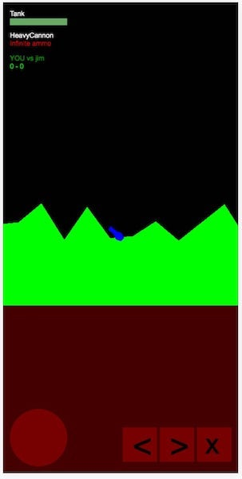

# artillery-p2p

Multiplayer only game. This is a POC (proof of concept) project that explores how
game logic / state synchronization needs to be handled to support a simple P2P connection.

Base tech:
- PeerJS library on top of WebRTC data channel ([SCTP](https://www.ibm.com/support/knowledgecenter/en/ssw_aix_72/com.ibm.aix.networkcomm/sctp_intro.htm))
- PeerJS broker server used with user registration and whitelisting
- Hollowed out ECS game engine ripped from Celestial Combat
    - hacked to be side-scrolling vs top-down 
 
## Playing

Go to http://jsyang.ca/artillery-p2p for the latest public build.

For each player:
1. Fill in your user id (e.g. `jim`)
1. Fill in your whitelisted peers as a comma separated list 
(e.g. `bob,joe,alex`) These people will be able to see you in the lobby and
connect to you.   
If you include `*` as one of the peers in this list, this means you are visible to everyone:
e.g. `bob,joe,*`
1. Click "Connect to lobby"
1. Select them on this list and click "Connect to selected player" to enter the game

### Controls

Keyboard: arrow keys for moving and rotating the cannon, F key to fire a shot.

This game has on screen controls for mobile browsers: not pretty, but functional:

## For developers

1. `yarn`
2. `yarn watch`
3. http://localhost:3000

You can either use the hardcoded broker server at https://peer-broker.herokuapp.com
or run your own and point to it with `http://localhost:3000?brokerURL=http://BROKER-SERVER-URL`

## Outstanding issues

- game state gets out of sync easily during play when latency / packet loss gets bad
  - ghost tanks may remain when you die
  - dead entities need to be removed
- need timestamping for outgoing and incoming messages for ordering
- [stun / turn server may be required](https://stackoverflow.com/questions/20068944)

## Learnings

### Logic
 
- each player has authority to synchronize entity state only for the entities
that they control: this is to avoid visual latency, jitters, and feedback loops 

- entities spawned out of game logic should only be done in the peer that controls
the respective team (e.g. things that explode only create shrapnel in the peer that caused the
explosion, to avoid doubling the number of resulting entities created)

- score syncing should be done only by the losing team

- logic should be as pure and deterministic as possible for networking because...

- game state handlers should reduce the serializable state that needs to be synced.
serialization for network needs to be significantly smaller in length 
than serialization for saved games

- only certain fields / types / categories of entities should be synchronized. independent game logic
on either peer can take care of non-essential states and converge to the same result

- entity creation Id needs to be maxed when syncing from network so we don't create any entities locally, 
which might have the same ID as one created by network game state update

### UX

- players know what a game lobby is, should use that metaphor to its full extent,
avoid over-exposing players to underlying network operations

- players need simple and responsive networking UI: player lists should auto-update, 
connections should be open immediately or fail gracefully to a state that presents 
further options (e.g. retry)  

### Security

- peers should either be open to the world or only accessible via whitelists. this stops
random peers from maintaining open connections (possible DOS attack)

- once connection to other peer is established, we should throw away the connection to the
peer broker. this will prevent any other peers from connecting to us.